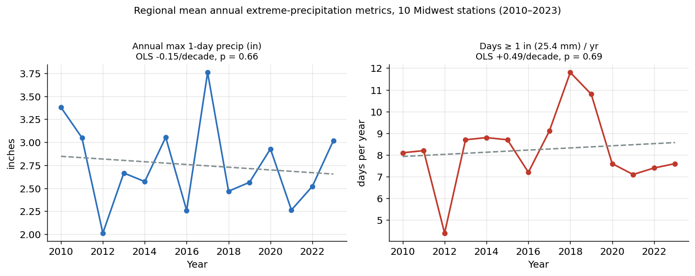
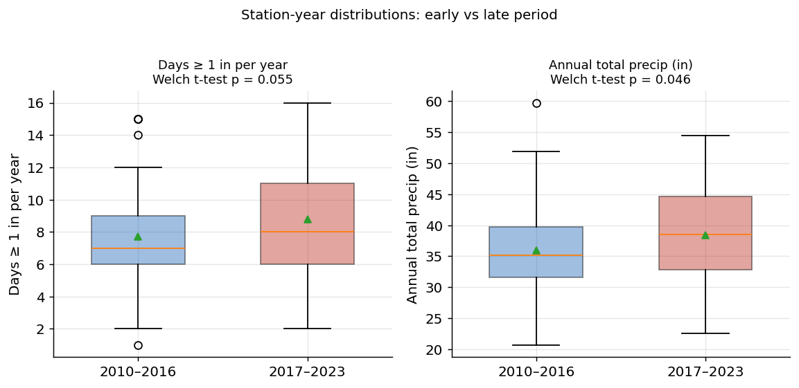
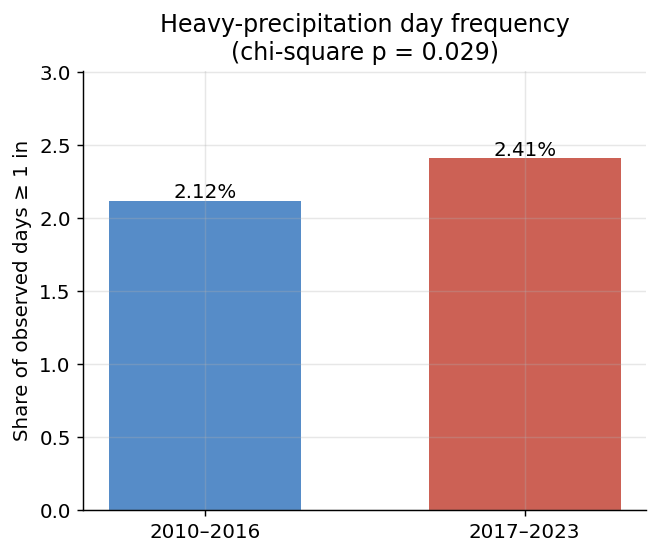
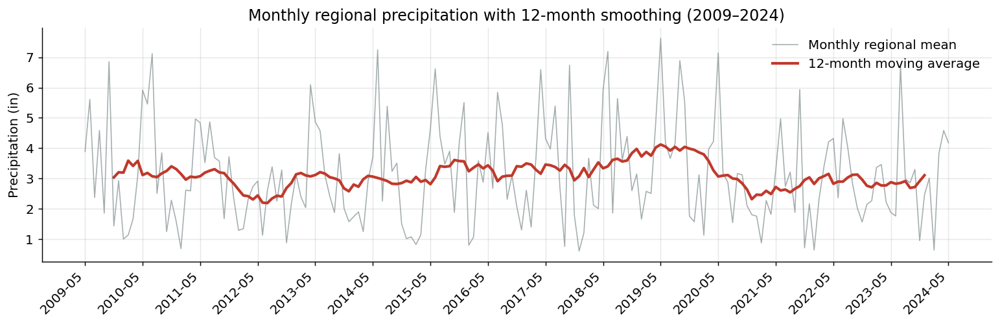
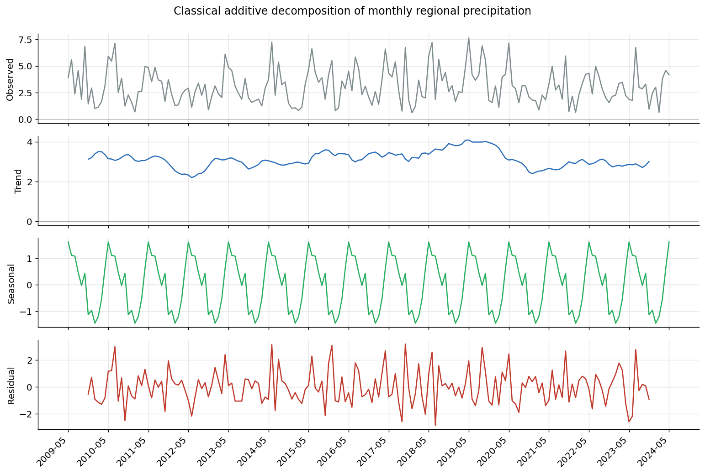
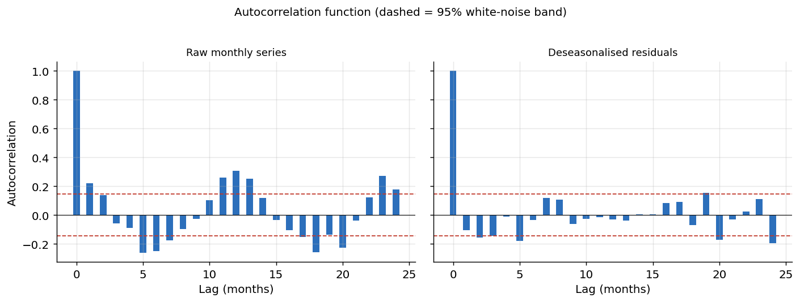
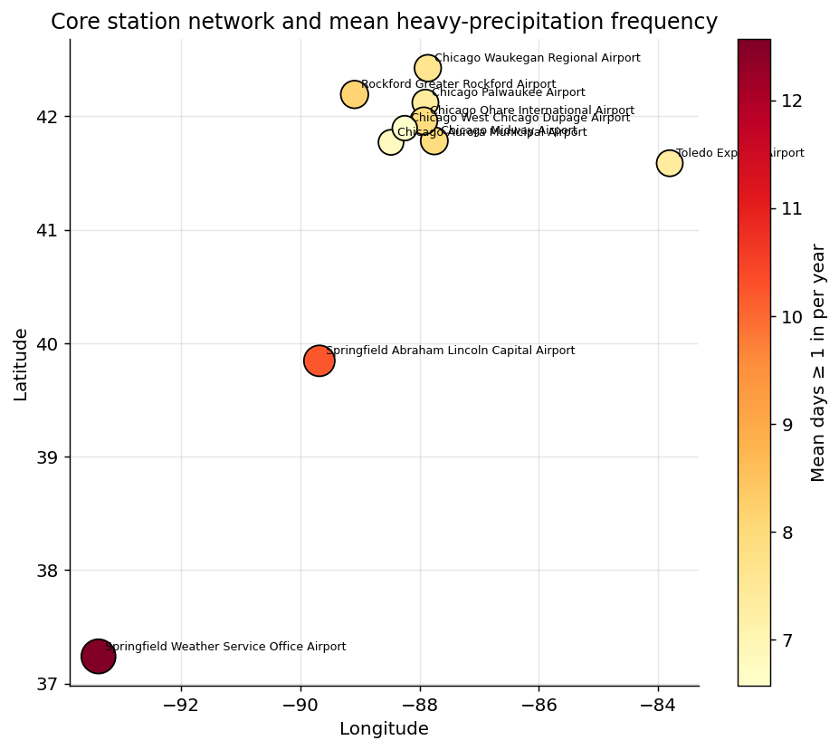

# Have Extreme Precipitation Events Increased Across the U.S. Midwest?

### An analysis of NOAA GHCN-Daily station records (2009–2024)

---

## 1. Introduction and Research Question

**Research question.** *Has the frequency or intensity of extreme
precipitation events changed across the U.S. Midwest over the available
observational record?*

This project began with the broader question of whether extreme precipitation
in the Midwest has increased over roughly the past 30 years (1990–2024).
However, when the daily station records were actually downloaded from NOAA, the
selected stations only carried continuous data back to **May 2009** (this
discrepancy, and how it was handled, is discussed openly in the Data and
Discussion sections). The question is therefore scoped honestly to the data in
hand: a ~15-year record, with the formal trend tests restricted to the **14
complete calendar years 2010–2023**.

**Why the question matters.** The Midwest is one of the most flood- and
agriculture-sensitive regions of the United States. Heavy downpours drive
flash flooding, overwhelm urban storm-water and combined-sewer systems, erode
farmland, delay planting, and damage infrastructure. A warmer atmosphere holds
more water vapor (roughly 7 % more per °C, the Clausius–Clapeyron relationship),
and national climate assessments report that the heaviest precipitation events
have already become more frequent and intense across the Midwest and Northeast.
Quantifying whether a *local* multi-station record shows the same fingerprint —
and being clear about what a short record can and cannot establish — is a
meaningful exercise in both climate science and honest data analysis.

---

## 2. Data

**Dataset.** Daily precipitation from the **NOAA Global Historical Climatology
Network – Daily (GHCN-Daily)** database, obtained through NOAA's Climate Data
Online tool (download file `4311294.csv`). The raw file contains one row per
station-day with the fields `STATION, NAME, LATITUDE, LONGITUDE, ELEVATION,
DATE, DAPR, MDPR, PRCP`. Precipitation (`PRCP`) is reported in **inches**
(NOAA "standard" units).

**Spatial coverage.** Thirteen stations were returned: ten in Illinois, two in
Ohio, one in Missouri, and one in Vermont. The Vermont station (Springfield
Hartness) is outside the Midwest and was used only for screening. The core
analysis network is the **10 Midwest stations with a complete record** —
Chicago O'Hare, Midway, Aurora, Palwaukee, Waukegan, West Chicago/DuPage,
Rockford, and Springfield (IL); Toledo (OH); and Springfield (MO). Station
coordinates and the heavy-rain frequency at each are mapped in **Figure 6**.

**Temporal coverage.** 2009-05-01 to 2024-05-31. Because 2009 is missing
January–April and 2024 is missing June–December, the annual trend analysis uses
only the **14 complete calendar years 2010–2023**. The monthly time-series
analysis uses all 181 available months.

**Main variables (after processing).** For each station-year: total annual
precipitation; the annual maximum 1-day precipitation (Rx1day); and counts of
days exceeding 0.5 in (12.7 mm), 1 in (25.4 mm), and 2 in (50.8 mm). The 1-inch
threshold corresponds to the ~25 mm "heavy precipitation" level noted in the
project proposal and is the primary extreme-event metric.

**Cleaning and processing** (`01_Code/01_clean_data.py`):

* Blank `PRCP` cells were treated as missing and excluded from sums and counts.
* States were parsed from the station name; a "core" flag marks the 10 Midwest
  stations with full coverage.
* **Two stations were excluded** from the core network for quality/coverage
  reasons and one for geography: `USC00116703` (Peoria, IL) has only 296 days
  of data; `USW00063888` (Beckley, OH) begins in 2017 **and contains an
  impossible value** — 24.98 inches in a single day and 305 inches for 2020,
  a clear data error; and `USW00054740` is in Vermont, outside the study
  region. All 13 stations are nonetheless retained in the processed
  `station_year_summary.csv` (with `core = 0/1`) for full transparency.
* Annual indices were computed for every year but only complete calendar years
  enter the trend tests.

The cleaning step reduces the 63,379-row raw file to three compact processed
tables in `03_ProcessedData/` (station metadata, station-year summary, and a
monthly regional series), which were verified against an independent
re-computation of the raw data.

---

## 3. Methods

Seven complementary techniques were chosen so that each addresses a specific
part of the research question, and so that a conclusion does not rest on any
single test or assumption. All tests were implemented in
`01_Code/stats_utils.py` (the analysis environment lacked SciPy/statsmodels, so
the required Student-t, F, and χ² tail probabilities were computed from
incomplete-beta/gamma functions and validated against textbook critical
values).

| # | Technique | What it answers | Variables |
|---|-----------|-----------------|-----------|
| 1 | **OLS linear regression** | Is there a linear trend in each annual extreme index? | index vs year (n = 14) |
| 2 | **Mann-Kendall + Theil-Sen** | Is there a *monotonic* trend, robust to non-normal extremes? | index vs year |
| 3 | **Pearson & Spearman correlation** | Strength/direction of the year–index relationship; do wet years simply have more heavy days? | year, total, heavy-day count |
| 4 | **Welch two-sample t-test** | Do station-year values differ between the early and late halves of the record? | early (2010–16) vs late (2017–23) |
| 5 | **χ² test of independence** | Is the *probability of a heavy-rain day* independent of period? | period × day-type contingency table |
| 6 | **Seasonal decomposition + smoothing** | What is the seasonal structure, and is there a smoothed long-run signal? | monthly regional series (181 mo.) |
| 7 | **Autocorrelation analysis** | Is the series serially dependent? Are regression residuals independent? | monthly series & residuals |

A supplementary **one-way ANOVA** tests whether heavy-rain frequency differs
across the ten stations (a spatial, rather than temporal, question).

**Hypotheses (trend / difference tests).** For the regression and Mann-Kendall
tests, H₀: no trend (slope = 0 / τ = 0) versus H₁: a trend exists. For the
Welch t-test, H₀: the early- and late-period means are equal versus H₁: they
differ. For the χ² test, H₀: heavy-day occurrence is independent of period
versus H₁: it is not. The significance level is α = 0.05 throughout.

---

## 4. Results

### 4.1 No detectable trend in the regional annual indices (Methods 1–3)

Averaged across the ten core stations, none of the annual extreme indices shows
a statistically significant trend over 2010–2023. The three trend approaches
agree, and even disagree in sign, which is itself a signature of "no trend"
(Table 1; Figure 1).

**Table 1. Trend tests on the regional annual indices (2010–2023, n = 14).**

| Index | OLS slope /decade | OLS p | Theil-Sen /decade | Mann-Kendall τ (p) | Spearman ρ (p) |
|-------|------:|------:|------:|------:|------:|
| Annual total (in) | +0.71 | 0.84 | −1.13 | −0.08 (0.74) | −0.15 (0.62) |
| Annual max 1-day (in) | −0.15 | 0.66 | −0.15 | −0.12 (0.58) | −0.21 (0.46) |
| Days ≥ 1 in / yr | +0.50 | 0.69 | 0.00 | +0.01 (1.00) | −0.11 (0.71) |
| Days ≥ 2 in / yr | −0.28 | 0.45 | −0.33 | −0.13 (0.54) | −0.24 (0.42) |
| Days ≥ 0.5 in / yr | +0.69 | 0.80 | −0.25 | −0.06 (0.83) | −0.15 (0.62) |

Every p-value is far above 0.05, and the R² values are essentially zero
(≤ 0.05). In plain terms: at the scale of a regional yearly average, the
14-year record contains no monotonic increase or decrease in extreme
precipitation that can be distinguished from natural year-to-year noise. The
year-to-year scatter is large — for example regional heavy-rain days swing from
4.4 (in the 2012 drought year) to 11.8 (in 2018) — which is exactly why a short
record has little power to detect a slow trend.

One correlation *is* strong and highly significant: regional annual total
precipitation and the number of ≥ 1 in days move together almost perfectly
(Pearson r = **+0.92**, p < 0.001). This confirms that in this region wet years
are wet primarily *because* they contain more heavy-rain days, not because of a
larger number of light-rain days — so heavy-day frequency is a sensible target
variable.

*Figure 1. Regional mean annual maximum 1-day precipitation (left) and number
of days ≥ 1 in (right), 2010–2023, with OLS trend lines. Both slopes are
statistically indistinguishable from zero.*

### 4.2 Pooled station data reveal a modest, significant rise in heavy-rain days (Methods 4–5)

The regional-average tests above use only 14 numbers and therefore have low
statistical power. Pooling the underlying **station-level** data (10 stations ×
7 years = 70 observations per period) increases power and tells a slightly
different story.

**Welch two-sample t-test (Table 2).** Splitting the record into an early half
(2010–2016) and a late half (2017–2023):

| Index | Early mean | Late mean | Difference | t | p |
|-------|------:|------:|------:|------:|------:|
| Days ≥ 1 in / yr | 7.73 | 8.77 | +1.04 | 1.94 | 0.055 |
| Annual total (in) | 35.93 | 38.40 | +2.47 | 2.01 | **0.046** |
| Annual max 1-day (in) | 2.71 | 2.79 | +0.08 | 0.44 | 0.66 |
| Days ≥ 2 in / yr | 1.43 | 1.41 | −0.01 | −0.07 | 0.94 |

Annual total precipitation is significantly higher in the late period
(p = 0.046), and heavy-rain (≥ 1 in) days are higher at the margin of
significance (p = 0.055). The most intense metrics — the annual maximum and the
≥ 2 in day count — are essentially unchanged.

**χ² test of independence (Table 3; Figure 7).** Counting every observed
station-day in the core network, the share of days that were "heavy" (≥ 1 in)
rose from **2.12 %** in 2010–2016 to **2.41 %** in 2017–2023. With a 2 × 2
contingency table (period × heavy/not-heavy), this difference is statistically
significant: **χ² = 4.80, df = 1, p = 0.029**, so we reject the hypothesis that
heavy-day occurrence is independent of period.

**Table 3. Heavy-rain day frequency by period.**

| Period | Days ≥ 1 in | Other observed days | Share ≥ 1 in |
|--------|------:|------:|------:|
| 2010–2016 | 541 | 24,978 | 2.12 % |
| 2017–2023 | 614 | 24,879 | 2.41 % |

*Figure 2. Station-year distributions of heavy-rain days (left) and annual
total precipitation (right) for the two periods. The late period shifts upward,
consistent with Tables 2–3.*

*Figure 7. Share of observed days that exceeded 1 inch, by period (χ² p = 0.029).*

### 4.3 Seasonality dominates the monthly signal (Method 6)

Decomposing the 181-month regional series additively (Figure 4) shows that the
**seasonal cycle is the dominant source of variability** (seasonal variance
≈ 1.0 versus a long-run trend variance of only ≈ 0.16). Climatologically the
region is wettest in **May** (about +1.6 in above the monthly mean) and the
early-summer months, and driest in **January** (about −1.5 in). The smoothed
12-month moving average (Figure 3) drifts up and down on multi-year timescales
but has no significant linear slope (decomposition-trend slope +0.003 in/yr,
p = 0.65), reinforcing the annual-scale finding of no clear long-run trend in
total water.

*Figure 3. Monthly regional precipitation (grey) with a 12-month moving average
(red).*

*Figure 4. Additive decomposition of the monthly series into trend, a strong
and stable seasonal cycle, and residual.*

### 4.4 The series is seasonal but not persistent (Method 7)

The autocorrelation function of the raw monthly series (Figure 5, left) shows
the expected fingerprint of seasonality: a negative spike at lag 6 months
(−0.25) and a positive spike at lag 12 months (+0.31), both outside the 95 %
white-noise band. After removing the seasonal component, the residual ACF
(Figure 5, right) collapses to within the noise band at essentially all lags
(lag-1 = −0.11), meaning month-to-month precipitation anomalies are close to
**serially independent**. The lag-1 autocorrelation of the *annual* regression
residuals (−0.34) also falls inside the wide white-noise band for n = 14
(±0.52), so the independence assumption behind the OLS trend test in §4.1 is
reasonable.

*Figure 5. Autocorrelation of the raw monthly series (left) versus the
deseasonalised residuals (right). Dashed lines are the 95 % white-noise band.*

### 4.5 Strong spatial variation in extreme frequency (supplementary ANOVA)

Heavy-rain frequency differs markedly across the network (one-way ANOVA
F = 5.86, df = (9, 130), p < 0.001). The Missouri station (Springfield, MO)
averages **12.6** days ≥ 1 in per year — far more than the Illinois stations
(~7.8) or Toledo, OH (7.4) — reflecting its more southerly, convectively active
location (Figure 6; Table 0). This spatial contrast is much larger than any
temporal change detected above.

*Figure 6. Core station network; marker size and color show the mean number of
≥ 1 in days per year. The Missouri station stands out.*

---

## 5. Discussion

**Does the analysis answer the research question?** Partly, and with important
caveats. The answer depends on the metric and the spatial scale:

* **Intensity of the most extreme events** (annual maximum 1-day rainfall,
  days ≥ 2 in): **no detectable change** over the record.
* **Frequency of moderate-heavy events** (days ≥ 1 in) and **total water**:
  a **modest increase** in the later half of the record that is statistically
  significant in the higher-powered pooled tests (χ² p = 0.029; t-test on annual
  total p = 0.046) but **not** in the 14-point regional-trend tests.

The most defensible reading is that the data are **weakly suggestive of an
increase in moderate-heavy precipitation frequency**, directionally consistent
with the thermodynamic expectation and with national assessments, but they do
**not** constitute strong evidence — and they say nothing about the most
intense tail. The two framings (no trend vs. a significant increase) are not
contradictory: the regional-average annual series has too few points and too
much noise to resolve a small trend, whereas pooling thousands of station-days
detects the same small shift because of the larger sample.

**Limitations, uncertainty, and assumptions.**

1. **Record length.** The single largest limitation. The original question
   asked about ~30 years; the available data cover only ~15, with two partial
   end-years removed. Detecting a climate trend in extreme precipitation
   typically requires 30–50+ years, so low statistical power — not absence of a
   real-world trend — is the most likely explanation for the null annual
   results.
2. **Pseudoreplication in the pooled tests.** The Welch t-test and χ² test
   treat station-years (and station-days) as independent, but nearby Chicago
   stations are spatially correlated and the same storm hits several at once.
   This inflates the effective sample size and makes the pooled p-values
   *optimistic*; the true uncertainty is larger than the nominal 0.029/0.046.
   The significant results should thus be read as "suggestive," consistent with
   the cautious conclusion above.
3. **One variable only.** Only precipitation was analysed; temperature, soil
   moisture, and atmospheric drivers (e.g., ENSO) that modulate Midwest rainfall
   were not included.
4. **Station network.** The network is dominated by Chicago-area airports, so
   it is really a "greater-Chicago + two outliers" sample rather than a
   balanced Midwest grid. A gridded product (e.g., PRISM or nClimGrid) would
   give more representative regional coverage.
5. **Multiple comparisons.** Several indices were tested; with five indices the
   chance of one marginal result by luck is non-trivial. The fact that the two
   significant results are *coherent* (total water and ≥ 1 in days, which are
   themselves correlated at r = 0.92) is reassuring but not decisive.

**What would improve the study.** Acquiring the full multi-decadal GHCN record
for each station (many of these airports have data back to the mid-20th
century) would directly restore the 30-year framing and the power to test it.
Adding a gridded precipitation product, applying a peaks-over-threshold /
extreme-value (GEV) model to the annual maxima, and accounting for spatial
correlation with a mixed-effects model would sharpen both the estimates and
their uncertainty.

---

## 6. Conclusion

Over the available 2009–2024 record for ten Midwest stations, the **most
intense** precipitation metrics (annual maximum 1-day rainfall and the number
of ≥ 2 in days) show **no change**, and the regional annual indices show **no
statistically significant trend** of any kind — the 14-year record is too short
to resolve one. At the same time, higher-powered tests that pool the
station-level data find a **modest, statistically significant increase in the
frequency of heavy-rain (≥ 1 in) days and in total annual precipitation** in
the second half of the record (≈ 2.1 % → 2.4 % of days; χ² p = 0.029). Taken
together, the evidence is **directionally consistent with — but far from
conclusive proof of — an increase in Midwest extreme precipitation**, and the
strongest, cleanest signal in the data is actually *spatial* (Missouri is much
wetter and stormier than the Chicago stations) rather than *temporal*. The
study's central lesson is methodological as much as climatological: a short
record can hide a real trend, and the choice of test, metric, and spatial scale
materially shapes the answer.

---

## 7. References

See `07_References/references.md` for full citations (NOAA GHCN-Daily; Menne et
al. 2012; USGCRP Fourth National Climate Assessment; Mann 1945; Kendall 1975;
Sen 1968; Press et al. 2007; NumPy, pandas, Matplotlib).

---

## 8. Generative AI Acknowledgment

Generative AI (Anthropic's Claude) was used as an assistant throughout this
project. Specifically:

* **Brainstorming and data discovery:** to generate candidate research
  questions in environmental/climate science and to suggest publicly available
  datasets (this is how the NOAA GHCN-Daily source was identified), as noted in
  the project proposal.
* **Data extraction and processing:** to parse the raw 63,379-row GHCN file,
  aggregate it into the station-year and monthly processed datasets, and flag
  the data-quality error in the Beckley, OH station.
* **Code:** to write the analysis pipeline (`01_clean_data.py`,
  `02_analyze_data.py`, `03_make_figures.py`) and, because the working
  environment had no SciPy/statsmodels, to implement the statistical
  distributions and tests from scratch in `stats_utils.py`.
* **Writing:** to draft and edit this report and the repository documentation.

**How the output was checked.** The statistics library was validated against
known textbook critical values (e.g., t, χ², F, and normal tail probabilities
all reproduced the 0.05 critical points to three decimals). The processed data
were verified byte-for-byte against an independent re-computation of the raw
file (character-count and checksum match). All reported numbers were produced
by the committed code, and the interpretation, scoping decisions (including the
honest reframing from a 30-year to a ~15-year window), and the limitations
discussion were reviewed and approved by the author. The AI accelerated the
mechanical work; the scientific judgments and final conclusions are the
author's own.
